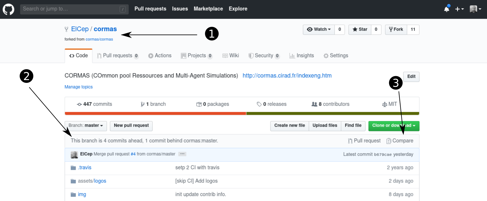
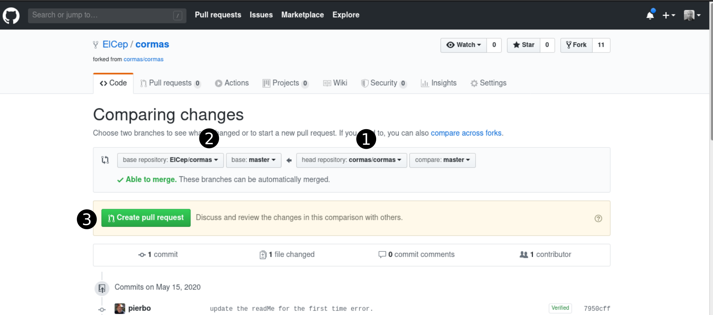

<!-- START doctoc generated TOC please keep comment here to allow auto update -->
<!-- DON'T EDIT THIS SECTION, INSTEAD RE-RUN doctoc TO UPDATE -->
- [Contribution Guide for CORMAS](#contribution-guide-for-cormas)
  - [Setup Iceberg](#setup-iceberg)
  - [Fork the CORMAS repository](#fork-the-cormas-repository)
  - [Load your fork version of CORMAS in your image](#load-your-fork-version-of-cormas-in-your-image)
  - [Add main CORMAS repository as remote](#add-main-cormas-repository-as-remote)
  - [Send some changes to the original CORMAS repository](#send-some-changes-to-the-original-cormas-repository)
      - [From Pharo Iceberg](#from-pharo-iceberg)
      - [From Github UI](#from-github-ui)
  - [Pull changes from original to fork](#pull-changes-from-original-to-fork)
    - [From GitHub GUI](#from-github-gui)
    - [Sync your fork with the CORMAS main repository](#sync-your-fork-with-the-cormas-main-repository)
  - [Cleanups](#cleanups)
- [Release management (not used at the moment)](#release-management-not-used-at-the-moment)
- [Branch management (to be defined)](#branch-management-to-be-defined)

<!-- END doctoc generated TOC please keep comment here to allow auto update -->

# Contribution Guide for CORMAS

*This file is currently not complete but will be improve step by step.*

You need to download Pharo 8.0 first.

## Setup Iceberg

You need an ssh key in order to commit on github. Open Iceberg tool, and then click on the settings. Check the box : "Use custom SSH keys".

## Fork the CORMAS repository

All changes you'll do will be versionned in your own fork of the [CORMAS repository](https://github.com/cormas/cormas). Then, from your fork you'll be able to issue pull requests to CORMAS, where they will be reviewed, and luckily, integrated.

Go to Cormas github's repository and click on the fork button on the top right. Yes, this means that you'll need a github account to contribute to CORMAS.

## Load your fork version of CORMAS in your image

In your Pharo 8.0 image, load now the last development version of CORMAS :

```Smalltalk
Metacello new
        onWarningLog;
        githubUser: 'XXX' project: 'cormas' commitish: 'master' path: 'repository';
        baseline: 'Cormas';
        load
```
where you replace XXX with your github user name.

## Add main CORMAS repository as remote

Open Iceberg, open CORMAS repository, click on repositories, then + button (add remote).

Remote name: upstream

Remote URL: https://github.com/cormas/cormas.git

## Send some changes to the original CORMAS repository

#### From Pharo Iceberg

After doing modifications in your image, open Iceberg tool, commit the changes in your CORMAS repository. Cherry-pick the modifications that you want to include in your commit. Then push your commit to your fork. It's more convenient to divide your changes in meaninfull and simple commits, which makes it easier to check for those who need to proofread it.


#### From Github UI

In the GitHub interface, create a Pull Request (PR) from your commit.
You have to give some information about what is the purpose of you pull request. Then submit it to CORMAS main repository.
This will notify CORMAS core developers team that an improvement or bug fix is pending.


As the main core developers, you have to review the open PRs. When merging the pull request, select *Create a merge commit* not  squash and merge. Try to avoid (except in case of emergency) to review your own commits.


## Pull changes from original to fork

You can proceed in two different ways to update your fork. You can either use github's web interface, or entirely from pharo/cormas.

### From GitHub GUI

If at some point, you see than the original cormas repository is ahead from your own fork (2 in the following picture) you can synchronize your own repository with all the newest features add to the original using compare (3)



To compare you can define sources (1) and target (2) for the update. Once it's done, you can use the pull request mechanism (3) to merge the original cormas code to your own.



The last step in this process, you'll just have to go back to your cormas Pharo a pull into your cormas image in the VM.

### Sync your fork with the CORMAS main repository

After a while, changes from other developers are integrated in the main CORMAS repository and your fork became out of sync.
In order to do that, you need the fetch the last modifications from the main CORMAS repository, merge them in your image and then push them in your fork repository.

In your own local machine containing your cloned fork directory (i.e. you forked first CORMAS, and then executed "git clone ..." your own fork), you should always synchronize your GitHub fork with the latest modifications in the upstream before pushing any updates (pull requests). This can be done from command-line:

```bash
git remote add upstream https://github.com/cormas/cormas.git
git fetch upstream
git checkout master
git rebase upstream/master
git push -f origin master
```

You have also the possibility to delete your fork and fork again the main CORMAS repository.

## Cleanups

Ounce your pull request is integrated, some cleanups are maybe required:
- remove your branch from your fork
- close the issue (tips: you can automatically close the issue n, by inserting the sentence: **close #n** when you merge your pull request).

# Release management (not used at the moment)

This project use semantic versionning to define the releases, meaning that each stable release of the project will be assigned a version number of the form `vX.Y.Z`.

- **X** define the major version number
- **Y** define the minor version number
- **Z** define the patch version number

- When a release contains only bug fixes, the patch number is incremented;
- When the release contains new backward compatible features, the minor version is incremented;
- When the release contains breaking changes, the major version is incremented.

Thus, it should be safe to depend on a fixed major version and moving minor version of this project.

# Branch management (to be defined)
